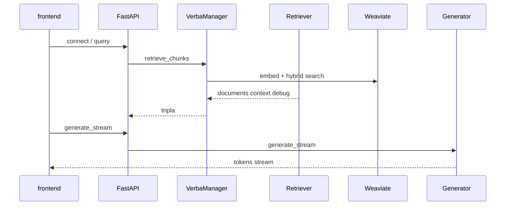

# Relatorio: Protocolo de Auditoria do Sistema RAG (implementado)

**Data:** 2026-04-24  
**Repositorio:** fork/customizacao de Golden Verba (weaviate) + `verba_extensions`  
**Base de conhecimento:** codigo, documentacao em `docs/`, e checagem pontual de arquivos listados

Este documento implementa o protocolo anexado: inventario, fluxos, qualidade de recuperacao, schema/dados, auditoria de orquestracao "agêntica", operacao/seguranca, cenarios de evidencia, e sintese executiva com roadmap e experimento minimo.

---

## 1. Fase 1: Inventario estrutural

### 1.1 Classificacao de diretorios

| Categoria | Caminhos | Papel |
|-----------|----------|--------|
| **core** | `goldenverba/` | Pacote Python: `VerbaManager`, `components` (readers, chunkers, embedders, retrievers, generation), `server` (FastAPI, static do Next export) |
| **custom** | `verba_extensions/` | Plugins `register()`, ETL, hooks, middleware de telemetria, compatibilidade Weaviate, integracao (import hook, schema updater, Tika fallback) |
| **frontend** | `frontend/` | Next.js 14; build copia estatico para `goldenverba/server/frontend/out/` (ver `frontend/package.json`) |
| **generated/static** | `goldenverba/server/frontend/out/` | Assets servidos por FastAPI |
| **infra** | `Dockerfile`, `docker-compose.yml`, `docker-compose.*.yml` | App em 8000, Weaviate 1.35.1 em 8080, env de API keys |
| **ops/scripts** | `scripts/` | Validacao, migracao, diagnostico, testes ad-hoc |
| **docs** | `docs/` | Guias, changelogs, analises; tratar como hipoteses a validar no codigo |
| **dados** | `data/`, volume `./data` no compose | Dados locais (ex.: CSVs de referencia) |
| **patches** | `patches/`, `verba_patch/` | Notas/artefatos de alinhamento upstream |

### 1.2 Entry points e versao

- **CLI:** `verba` = `goldenverba.server.cli:cli` (`setup.py`, versao `goldenverba` 2.1.5).
- **Servidor ASGI:** `uvicorn` em `goldenverba.server.api:app` (porta default 8000 em fluxos documentados).
- **Extensoes:** importadas no topo de `goldenverba/server/api.py` antes de `VerbaManager()`; `verba_extensions/startup.py` carrega `ExtensionLoader`, aplica patch Weaviate v3, `import_hook` + `verba_manager`, `schema_updater`, Tika fallback, e `register_hooks` por plugin.
- **Python:** `>=3.10,<3.13` (`setup.py`).

### 1.3 Stack tecnologica (resumo)

- Backend: FastAPI, Weaviate async client, asyncio/WebSockets, componentes RAG modulares.
- Vetores: Weaviate como store principal; hibrido BM25 + vector em `WeaviateManager` (caminho citado em `docs/API_GUIDE.md` e analises).
- Extensoes: spaCy, gliner, LangChain text splitters, ETL A2, GraphQL helpers em `verba_extensions/utils/`.

### 1.4 Superficies HTTP/WebSocket (lista funcional)

Registrado em `goldenverba/server/api.py` (grep de rotas):

- **Saude e front:** `GET /`, `GET /api/health`
- **Conexao e config:** `POST /api/connect`, `get/set` user/theme/rag, presets de reranker
- **RAG e consulta:** `POST /api/query`, `POST /api/external/query`, `POST /api/query/validate`, `/execute`, `/aggregate`
- **Documentos e vetores:** varios `POST` sob `/api/get_*`, `/api/documents/*`, delete, reset, meta
- **WebSockets:** `/ws/generate_stream`, `/ws/import_files` (com semaforo de import sequencial)
- **Telemetria:** `GET /api/telemetry/stats`, `GET /api/telemetry/slo` (com `TelemetryMiddleware`)

**Entregavel fase 1:** mapa acima; fronteira core vs custom clara: comportamento nao-upstream concentra-se em `verba_extensions` e patches no startup.

---

## 2. Fase 2: Reconstrucao dos fluxos principais

### 2.1 Conexao

1. Cliente (browser ou API) chama `POST /api/connect` com credenciais Weaviate.
2. `ClientManager` estabelece cliente; `VerbaManager.load_rag_config` / `load_user_config` / `load_theme_config` leem do Weaviate.
3. Resposta traz `rag_config`, `user_config`, `theme` para o frontend.

**Arquivos:** `goldenverba/server/api.py` (`connect_to_verba`), `goldenverba/verba_manager.py` (`connect`, `load_*_config`).

### 2.2 Ingestao (alto nivel)

1. Upload/import via WebSocket `ws/import_files` ou caminhos equivalentes (conforme `api.py`).
2. `VerbaManager.import_document` valida `FileConfig`, evita duplicata por nome, orquestra reader a partir do RAG config.
3. Documento e chunkado pelo chunker selecionado; extensao pode enriquecer via `chunk_processor`, ETL A2 (`a2_etl_hook`, `verba_extensions/etl/`), e hooks de `import_hook` no `WeaviateManager`.
4. Embeddings gerados pelo embedder ativo; upsert no Weaviate (batch) com possivel enriquecimento de metadados (ex.: `llm_metadata_extractor` se usado no pipeline).
5. Sem fila externa: trabalho e majoritariamente `async` no processo do servidor; `asyncio.Semaphore(1)` serializa import na API.

**Arquivos:** `goldenverba/verba_manager.py` (`import_document` e cadeia ate upsert), `verba_extensions/integration/import_hook.py`, `verba_extensions/startup.py`.

### 2.3 Consulta (retrieval)

1. Cliente envia `POST /api/query` com `query`, `credentials`, `RAG` (config completo).
2. `VerbaManager.retrieve_chunks` resolve retriever e embedder selecionados, chama `embedder_manager.vectorize_query`, depois `retriever_manager.retrieve` (tipicamente `EntityAware` quando configurado).
3. Extensoes no retriever: query builder, rewriter, filtro de entidade, janela de chunks, rerank, cache, multi-vector (conforme flags e RAG config).
4. Retorno: documentos, string de `context` para o gerador, e `debug_info` (contrato 3-tupla em `verba_manager.py`).

**Arquivos:** `goldenverba/verba_manager.py` (`retrieve_chunks`), `goldenverba/components/managers.py` (`RetrieverManager`, `WeaviateManager.hybrid_*`), `verba_extensions/plugins/entity_aware_retriever.py` e relacionados.

### 2.4 Geracao (streaming e RAG 2.0)

1. Chat usa WebSocket `ws/generate_stream` (e caminhos que montam o mesmo `rag_config`).
2. `VerbaManager.generate_stream_answer` delega a `GeneratorManager.generate_stream` com `prepare_messages` no generator (ver `docs/TECHNICAL.md`).
3. **RAG 2.0 iterativo:** `generate_stream_answer_iterative` importa `IterativeSearchPlugin` de `verba_extensions/plugins/iterative_search.py`, injeta `retrieve_chunks` como callback quando o modelo emite padroes de busca adicional no stream.

**Arquivos:** `goldenverba/verba_manager.py` (linhas ~1299+), `verba_extensions/plugins/iterative_search.py`.

### 2.5 Configuracao

- RAG e persistido/alterado via endpoints `get/set` em `api.py`; a forma exata do payload `Advanced` e critica (documentado em `docs/API_GUIDE.md` com exemplo de "fix" da estrutura aninhada).

**Diagrama de sequencia (resumo):**

**Entregavel fase 2:** fluxos acima ancorados em arquivos; loops async e WebSocket sao a espinha dorsal, nao um job queue distribuido.

---

## 3. Fase 3: Auditoria RAG e qualidade de recuperacao

Matriz alinhada a `docs/analises/ANALISE_ROBUSTEZ_INGESTAO_RETRIEVAL_TOOLS_2026-04-24.md` (validar flags no codigo ao afinar produção).

| Mecanismo | Ativacao (resumo) | Pre-condicoes | Riscos | Evidencia (entrada) |
|-----------|-------------------|---------------|--------|---------------------|
| Hybrid BM25+vector | Caminho `WeaviateManager.hybrid_chunks*` | Config de alpha, limit, collections existentes | Alpha mal calibrado | `managers.py`, analise 2026-04-24 |
| Filtros entity-aware | `EntityAwareRetriever` + `where` | Schema ETL/entidades preenchidos; senao queda de recall | Zero resultados, filtros agressivos | `entity_aware_retriever.py` |
| Modos de filtro (strict/boost/adaptive/hybrid) | RAG/Advanced do retriever | Dados e gazetteer coerentes | Comportamento opaco se mal documentado | analise 2026-04-24 |
| Two-phase search | Flags no pipeline entity-aware | Entidade clara | Overhead, tuning | analise 2026-04-24 |
| Named vectors / target | `vector_config` / `target_vector` | Multi-embedding consistente com ingest | Desalinhamento ingest vs query | `API_GUIDE.md`, `hybrid_embedder` |
| Multi-vector (experimental) | Plugin/config | Chunks com vetores preenchidos | Custo, latencia | `multi_vector_searcher.py`, analise |
| Query builder | `query_builder.py` (schema-aware) | Schema acessiveis, cache de schema | 1a chamada mais cara | `extension_loader` exclui arquivo como plugin standalone; carregado como utilitario |
| Query rewriter / expansion | `query_rewriter`, `query_expander` | Fallback sem builder | Pode "alucinar" termos de busca | plugins |
| Aggregations | Rota e deteccao no fluxo de query | Perguntas analiticas | Nao e RAG de passagem | `api.py` `/api/query/aggregate` |
| Rerank + cascade | `reranker`, `dynamic_reranker` | Custo de API/latencia | Custo de tokens/segunda etapa | plugins |
| Relevance gate / threshold | Config Advanced/Retriever | Base heterogenea | Bloquear respostas "corretas" com score baixo | documentacao de presets |
| Cache inteligente | `intelligent_cache` | Queries repetitivas | Stale se indices mudam | plugin |

**Entregavel fase 3:** matriz acima; confirmacao de que a busca nao e "function calling de agente" e sim **pipeline de retriever + extensWeaviate** com LLMs em rewriter/builder quando habilitado.

---

## 4. Fase 4: Estado, schema e dados

### 4.1 Autoridade de schema

- `verba_extensions/integration/schema_updater.py` define propriedades padrao (chunk_id, content, doc_uuid, labels, chunk_date, etc.) e blocos de propriedades ETL (`get_etl_properties` em diante - arquivo extenso).
- Campos alinhados a documentacao de named vectors e ETL em `docs/API_GUIDE.md` (ex.: `companies`, `sectors`, `frameworks`, textos `concept_text`, `sector_text`, `company_text`).

### 4.2 Riscos de integridade

- **Drift** entre colecao real no Weaviate e expectativas dos plugins (ETL off vs on).
- **Document vs chunk** campos: filtros hierarquicos exigem `doc_uuid` e entidades corretas em nivel adequado.
- **UUIDs e meta:** import guarda `meta` JSON com config do embedder; inconsistencia quebra re-fetch de chunks.

**Entregavel fase 4:** inventario conceitual: fonte de verdade do schema = codigo do `schema_updater` + `verify_collection` apos patches; documentacao e complementar.

---

## 5. Fase 5: Auditoria de orquestracao e "agêntica"

### 5.1 Classificacao

| Dimensao | Leitura |
|----------|--------|
| Tipo primario | **Pipeline RAG (workflow LLM-enriched)**: etapas de ingest, retrieve, generate sao conhecidas; configuraveis. |
| Tipo secundario | **Iteracao controlada (RAG 2.0)**: `generate_stream_answer_iterative` + `IterativeSearchPlugin` = loop curto e limitado (max iterations), nao agente aberto. |
| Nao e | Multi-agente generalista, LangGraph como runtime, ou tool-use ilimitado estilo "computer use". |

### 5.2 Necessidade de framework agêntico adicional

- **Necessidade de autonomia aberta, replanejamento geral, HITL, checkpointing de grafo:** baixa para a maior parte do produto; o valor esta em Weaviate + extensoes de retrieval.
- **Onde "agent" aparece no nome (QueryAgent vs QueryBuilder, etc.):** tratar como **nomes de componente**, nao como runtime de agente; validar trafego real em `retriever` e `query_*` modulos.

### 5.3 Scores (0-100, estimativa baseada no codigo e docs)

| Score | Valor | Nota |
|-------|-------|------|
| Agentic need | 35 | Iterativo e rewriter adicionam autonomia local |
| Workflow explicitness | 80 | RAG e configuravel e rastreavel |
| Runtime autonomy | 30 | Sem loop geral; iterative com teto |
| Node/state quality | 65 | Forte, mas patches e ETL elevam acoplamento |
| Failure recovery criticality | 50 | Re-import e re-query; sem fila com checkpoint de job |
| Tool portability | 55 | Focado em Weaviate + fornecedores de LLM embedding |
| Human governance | 40 | Nao inerente; depende de UI/politicas |
| Current architecture health | 70 | Funcional; complexidade em extensoes |
| No-framework / simplification fit | 45 | Simplificar possivel, mas muito valor esta nas extensoes |
| LangGraph fit | 35 | Util se quiser grafo explicito e checkpoint de workflow longo |
| Claude Agent SDK fit | 25 | Util se o produto for "copilot operacional" fora do RAG |
| OpenAI Agents SDK fit | 30 | Paridade parcial; stack ja multi-provider no Verba |
| Migration justification | 20 | Risco: migrar sem corrigir dados/schema primeiro |

### 5.4 Comparacao breve (este sistema, nao generica)

- **Simplificacao + pipeline deterministico + menos LLM no caminho de query:** alinha com custo e debug; pode perder recall em consultas ruidosas.
- **LangGraph:** ganha se precisar de **fluxos de negocio longos** com interrupcao/retomada; para RAG padrao e overhead.
- **Claude / OpenAI Agents SDK:** ganham se a meta for **acao em ferramentas externas** (shell, tickets) com o mesmo app; o repo hoje nao e centrado nisso.

**Veredeto:** manter a arquitetura RAG + extensoes; introduzir framework agêntico **somente** se surgirem requisitos claros de tarefa aberta, multi-passos operacionais ou HITL em grafo, com piloto pequeno.

**Entregavel fase 5:** classificacao e scores; decisao: **nao migrar** por framework por padrao; evoluir iterativo e modulos de query com testes de evidencia.

---

## 6. Fase 6: Observabilidade, debug e operacao

### 6.1 Sinais existentes

- `TelemetryMiddleware` (`verba_extensions/middleware/telemetry.py`): latencia por rota, percentis, SLO, logs JSON; exposto em `/api/telemetry/*`.
- Logs de aplicacao via `wasabi` / `msg` e helpers no servidor.
- `verba_extensions/utils/telemetry.py` (citar em ops): metricas de qualidade ETL conforme `grep`/docs.
- `scripts/`: bateria de `validate_*`, `inspect_*`, `fix_*` para Weaviate e chunks; classificar por README em `docs/SCRIPTS_README.md` quando for usar em producao.

### 6.2 Lacunas tipicas

- Trazar ID unico de request do browser ate chunk IDs no Weaviate (correlacao) pode exigir header ou campo custom em logs.
- WebSocket nao entra no mesmo path de middleware que HTTP; confirmar se latencia de `generate_stream` e medida como desejado.

**Entregavel fase 6:** mapa de sinais; runbook minimo: reproduzir com payload fixo em `POST /api/query` + RAG congelado, comparar `debug_info`, checar `telemetry/stats` apos carga.

---

## 7. Fase 7: Seguranca e superficie externa

| Topico | Achado | Impacto | Mitigacao estrutural |
|--------|--------|---------|------------------------|
| CORS + origem | `CORSMiddleware` com `allow_origins=["*"]` e middleware custom `check_same_origin` que bloqueia `/api/*` com 403 se Origin nao bater (exceto health, regras env `ALLOWED_ORIGINS`, Railway) | **Medio** | Configurar `ALLOWED_ORIGINS` em producao; nao depender de CORS "aberto" embora a lista seja * |
| Credenciais | API keys de LLM/embed em env (`docker-compose`, `goldenverba/.env.example`); some keys passadas a Weaviate no compose | **Alto** se repo vaza | Secrets so em vault/env do deploy; nao commitar .env |
| Weaviate anonimo | Compose local com `AUTHENTICATION_ANONYMOUS_ACCESS_ENABLED: true` | **Alto** em rede aberta | Autenticacao Weaviate e rede privada em producao |
| Arquivo upload / readers | Leitura de URL, Git, drive, etc. (plugins) | **Medio/Alto** SSRF, exfiltracao | Allowlist de esquemas, sandbox de rede, desabilitar leitores nao usados |
| Prompt injection | Documentos e queries alimentam LLM; iterative search re-consulta com query derivada do modelo | **Medio** | Tratar documentos como nao confiaveis; limitar iterative; revisar instrucoes do generator em `components/interfaces` |
| Documentacao com URLs | `API_GUIDE.md` referencia host publico; e documentacao, nao codigo de produto | Baixo | Nao tratar URL em doc como API contract sem validar instancia |

**Entregavel fase 7:** lista acima; priorizar chaves, Weaviate, e controle de origem.

---

## 8. Fase 8: Cenarios minimos de evidencia

Cada cenario: registrar RAG config (JSON reduzido), `query`, tempo aproximado, IDs de documento, e trecho de `debug_info` se disponivel.

1. Ingestao curta: um TXT/MD com texto controlado; verificar contagem de chunks e presenca no Weaviate.
2. Ingestao com ETL/entidades: documento com empresas conhecidas; checar campos ETL se chunker+ETL ativos.
3. Query aberta, sem entidade: hybrid default; medir se rewriter altera a query.
4. Query com entidade explicita: validar pre-filtro e ausencia de contaminacao.
5. Pergunta de agregacao: acionar `POST /api/query/aggregate` (se habilitado no fluxo de UI/API).
6. Named vector: consulta alinhada a `company_vec` vs `default` e comparar resultados.
7. Falha simulada: chave API invalida ou Weaviate down; resposta 4xx/5xx e corpo de erro.

**Entregavel fase 8:** caderno de testes (pode anexar planilha ou repetir tabela com resultados reais preenchidos no futuro).

---

## 9. Fase 9: Sintese executiva

### 9.1 Como o sistema funciona hoje

Aplicacao **full-stack** Verba: FastAPI serve API + estatico Next; **Weaviate** armazena chunks e vetores; **verba_extensions** adiciona leitores, chunking semantico/entidade, ETL, retriever entity-aware, query intelligence, rerank, cache, GraphQL, telemetria e **RAG 2.0** via busca iterativa no stream. Nao ha fila de jobs separada: concorrencia e **async** e **WebSocket** no mesmo processo.

### 9.2 Pontos fortes

- Pipeline modular (reader/chunker/embedder/retriever/generator) e RAG config persistente.
- Extensoes ricas para busca hibrida, entidades, e multi-vetor alinhado a Weaviate v4.
- Telemetria HTTP e documentacao extensa em `docs/`.

### 9.3 Pontos frageis

- **Complexidade** em extensoes e patches; onboarding exige leitura de `startup.py` e `managers.py`.
- **Operacao** depende de coerencia de schema, ETL, e tuning de knbs (alpha, modos, gates).
- **Seguranca** requer `ALLOWED_ORIGINS`, Weaviate nao anonimo, e cuidado com readers de URL.

### 9.4 Tabela de achados priorizados (Priority Findings)

| Achado | Evidencia | Impacto | Urgencia | Acao |
|--------|-----------|---------|----------|------|
| Acoplamento core + patches no startup | `verba_extensions/startup.py` | Medio | P2 | Documentar dependencias; testes de fumaca pos-upgrade Verba |
| RAG 2.0 depende de padrao de tokens no stream | `verba_manager.py` + `iterative_search.py` | Medio | P2 | Testes de regressao; limitar iteracoes e custo |
| Superficie de leitores externos | plugins `*_reader` | Medio/Alto | P1 | Desabilitar o que nao e usado; allowlist de rede |
| Simplificacao vs extensoes | Tamanho de `verba_extensions` | Medio | P3 | Roadmap de modularizacao, nao "big bang" de framework agêntico |

### 9.5 Roadmap (H1 / H2 / H3)

- **H1 (correcoes imediatas):** fixar `ALLOWED_ORIGINS` e revisar exposicao Weaviate; congelar um preset RAG de referencia; executar 3 cenarios de evidencia (1-3) e arquivar resultados.
- **H2 (refatoracoes estruturais):** testes de integracao com Weaviate em CI ou conteiner; documentar "single source" para `Advanced` RAG config; reduzir dependencia implicita em env typo (`SYSYEM_MESSAGE` se ainda presente) documentando a variavel correta.
- **H3 (evolucao arquitetural):** se surgirem workflows longos com HITL, prototipar **um** orquestrador (ex. LangGraph) **apenas** para subsistema nao critico, sem migrar o RAG core.

### 9.6 Menor experimento de validacao

**Experimento unico (1-2 dias):** Subir `docker-compose`, ingerir **um** documento sintetico com duas entidades, executar **duas** queries (uma com entidade, uma com ambiguidade) com o **mesmo** RAG config salvo, capturar `debug_info` e latencia de `/api/telemetry/stats` para `POST /api/query`. **Criterio de sucesso:** explicar por que os chunks diferem, sem ajuste manual de knobs, ou documentar o knob minimo que mudou a decisao.

---

## 10. Criterios de conclusao do protocolo (checklist)

- [x] Caminho documento a chunk vetorizado: descrito (secao 2.2) com arquivos.
- [x] Caminho query a resposta stream: descrito (2.3-2.4).
- [x] Knobs que mudam comportamento: RAG config (incl. Advanced), selecao de componentes, flags em extensoes (secao 3).
- [x] Extensoes: inventariadas; essenciais vs experimentais: inferido (multi-vector, iterative = maior risco/valor).
- [x] Falhas por categoria: arquitetura vs dados vs operacao: distribuido nas secoes 4-7.
- [x] Migrar para framework agêntico: resposta em 5.4 - **nao e padrao**; hipotese condicional.

---

## Referencias de arquivo (indice)

| Area | Ficheiro principal |
|------|-------------------|
| API | `goldenverba/server/api.py` |
| Orquestracao | `goldenverba/verba_manager.py` |
| Startup extensoes | `verba_extensions/startup.py` |
| Loader | `verba_extensions/extension_loader.py` |
| Schema ETL | `verba_extensions/integration/schema_updater.py` |
| Telemetria | `verba_extensions/middleware/telemetry.py` |
| Iteracao RAG2 | `verba_extensions/plugins/iterative_search.py` |
| Compose | `docker-compose.yml` |
| Env exemplo | `goldenverba/.env.example` |
| Analise interna (base secao 3) | `docs/analises/ANALISE_ROBUSTEZ_INGESTAO_RETRIEVAL_TOOLS_2026-04-24.md` |

Fim do relatorio.
